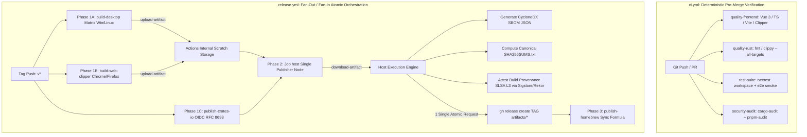

# CI/CD Architecture # Production CI/CD Architecture & Implementation Blueprint Implementation Blueprint
## SoloMD Multi-Target Desktop Ecosystem (Tauri v2 / Rust / TypeScript / MCP)

- **Document Version:** 3.2.0 (Systems Architecture Standard)
- **Target Repository:** `solomd`
- **Scope:** Desktop Core (`app/`), MCP Server (`mcp-server/`), Web-Clipper (`web-clipper/`), Documentation/Web (`web/`), Native Shell Automation (`scripts/`), Distribution Taps (`zhitongblog/homebrew-cask`)
- **Compliance & Security Frameworks:** SLSA Supply Chain Level 3 (Fulcio/Rekor Transparencies), OIDC RFC 8693 (Ephemeral Tokens), CycloneDX v1.5 JSON SBOM, Deterministic Agentic CI/CD
- **Action Toolchain Baselines (Latest Verified 2026 Releases):**
  - `actions/checkout@v7` (v7.0.1, Node 20+ runtime, high-throughput shallow/submodule fetching)
  - `actions/setup-node@v7` (v7.0.0)
  - `actions/cache@v6` (v6.1.0)
  - `actions/upload-artifact@v7` (v7.0.1)
  - `actions/download-artifact@v8` (v8.0.1)
  - `actions/attest-build-provenance@v4` (v4.2.2, SLSA v1.0 Level 3 provenance signing)
  - `pnpm/action-setup@v6` (v6.1.0)
  - `dtolnay/rust-toolchain@stable`
  - `Swatinem/rust-cache@v2` (v2.9.2)
  - `taiki-e/install-action@v2` (v2.87.7)
  - `rust-lang/crates-io-auth-action@v1` (v1.0.5, RFC 8693 OIDC exchange)

---

## 1. Executive Summary & Problem Formulation

SoloMD is an asynchronous multi-platform ecosystem combining a high-performance Rust core (Tauri v2), a high-density presentation layer (Vue 3 / TypeScript), decoupled background daemons (MCP sidecars), a WebExtension surface (`web-clipper`), and native desktop distribution channels.

### 1.1 Root-Cause Failure Analysis of Legacy Infrastructure
1. **The Monolithic Ingestion Anti-Pattern**: The legacy pipeline lacked isolated pre-merge validation gates on Pull Requests. Regressions in type invariants, Clippy warnings, and security advisories passed undetected into the `main` branch.
2. **Concurrent Draft Release API Contention (Race Conditions)**: Multiple platform build runners simultaneously attempted GitHub Release draft instantiation, causing non-deterministic API lockups (`HTTP 422 Unprocessable Entity`) and truncated bundle uploads.
3. **`externalBin` Build-Time Invariant Panic**: In Tauri v2, `tauri-build` evaluates the physical presence of `bundle.externalBin` targets at `build.rs` execution time. Running `cargo clippy` or `cargo nextest` without an explicit pre-compilation step causes immediate panic (`resource path binaries/solomd-mcp-<triple> does not exist`).
4. **Supply Chain Exposure & Static Credentials**: Standalone `solomd-mcp` publication previously depended on static tokens, failing zero-trust and least-privilege security baselines.
5. **Missing Homebrew Tap Automation in CI**: Package updates to `zhitongblog/homebrew-cask` previously relied on manual execution of `scripts/publish-packages.sh`, creating version divergence between GitHub Releases and Homebrew.
6. **Runtime Dynamic Linking Regressions (Linux Issue #170)**: Linux AppImages built against outdated toolchains caused runtime crashes on modern Linux graphics stacks (Mesa >= 26.x / GLib 2.80+).
7. **Agentic Feedback Degradation**: Autonomous coding agents suffered from unstructured raw log parsing, lacking SARIF/JSON diagnostic feeds required for deterministic self-healing loops.

---

## 2. High-Density Pipeline Topology: Fan-Out / Fan-In Orchestration

```
                   [ Tag Push: v* ]
                          │
       ┌──────────────────┼──────────────────┐
       ▼ (Fan-Out)        ▼ (Fan-Out)        ▼ (Fan-Out)
 ┌───────────────┐ ┌───────────────┐ ┌───────────────┐
 │ build-desktop │ │ web-clipper   │ │ crates-io OIDC│
 │ (4 Matrix OS) │ │ (Chrome/FF)   │ │ (Ephemeral)   │
 └───────┬───────┘ └───────┬───────┘ └───────┬───────┘
         │                 │                 │
         └─────────┬───────┴─────────────────┘
                   ▼ (upload-artifact)
     [ GitHub Actions Internal Scratch Storage ]
                   │
                   ▼ (Fan-In: download-artifact)
         ┌───────────────────┐
         │     Job: host     │ (Single Atomic Publisher Node)
         │  • CycloneDX SBOM │
         │  • SHA256SUMS.txt │
         │  • SLSA L3 Attest │
         └─────────┬─────────┘
                   │
                   ▼ (1 Single Atomic HTTP Request)
      [ gh release create "$TAG" artifacts/* ]
                   │
                   ▼ (Post-Release Sync)
      ┌─────────────────────────┐
      │ Job: publish-homebrew   │ (Updates zhitongblog/homebrew-cask)
      └─────────────────────────┘
```



---

## 3. Production Workflow Specifications

### 3.1. Continuous Integration Specification (`.github/workflows/ci.yml`)

```yaml
name: CI

on:
  push:
    branches: [ main ]
  pull_request:
    branches: [ main ]

permissions:
  contents: read

concurrency:
  group: ci-${{ github.head_ref || github.run_id }}
  cancel-in-progress: true

env:
  CARGO_TERM_COLOR: always

defaults:
  run:
    shell: bash

jobs:
  quality-frontend:
    name: "Frontend Typecheck & Build"
    runs-on: ubuntu-latest
    timeout-minutes: 15
    steps:
      - uses: actions/checkout@v7
        with:
          persist-credentials: false

      - uses: actions/setup-node@v7
        with:
          node-version: lts/*

      - uses: pnpm/action-setup@v6
        with:
          version: 10

      - uses: actions/cache@v6
        with:
          path: ~/.local/share/pnpm/store
          key: pnpm-store-${{ runner.os }}-${{ hashFiles('**/pnpm-lock.yaml') }}
          restore-keys: |
            pnpm-store-${{ runner.os }}-

      - name: Validate App Frontend
        working-directory: app
        run: |
          pnpm install --frozen-lockfile
          pnpm build

      - name: Validate Web Clipper
        working-directory: web-clipper
        run: |
          pnpm install --frozen-lockfile
          pnpm typecheck

  quality-rust:
    name: "Rust Static Analysis"
    runs-on: ubuntu-latest
    timeout-minutes: 15
    steps:
      - uses: actions/checkout@v7
        with:
          persist-credentials: false

      - uses: dtolnay/rust-toolchain@stable
        with:
          components: rustfmt, clippy

      - uses: Swatinem/rust-cache@v2
        with:
          workspaces: |
            app/src-tauri -> target
            mcp-server -> target
            dev-mcp -> target

      - name: Check Formatting
        run: |
          cargo fmt --manifest-path app/src-tauri/Cargo.toml --all -- --check
          cargo fmt --manifest-path mcp-server/Cargo.toml --all -- --check

      - name: Pre-build MCP Sidecar (Tauri build.rs invariant)
        run: |
          TRIPLE="$(rustc -vV | sed -n 's/^host: //p')"
          bash scripts/build-mcp-sidecar.sh "$TRIPLE"

      - name: Execute Clippy Lints
        run: |
          cargo clippy --manifest-path app/src-tauri/Cargo.toml --all-targets -- -D warnings
          cargo clippy --manifest-path mcp-server/Cargo.toml --all-targets -- -D warnings

  test-suite:
    name: "Automated Test Suite"
    runs-on: ubuntu-latest
    timeout-minutes: 20
    steps:
      - uses: actions/checkout@v7
        with:
          persist-credentials: false

      - uses: dtolnay/rust-toolchain@stable

      - uses: Swatinem/rust-cache@v2
        with:
          workspaces: |
            app/src-tauri -> target
            mcp-server -> target

      - uses: taiki-e/install-action@v2
        with:
          tool: cargo-nextest

      - name: Pre-build MCP Sidecar (Tauri build.rs invariant)
        run: |
          TRIPLE="$(rustc -vV | sed -n 's/^host: //p')"
          bash scripts/build-mcp-sidecar.sh "$TRIPLE"

      - name: Execute Rust Unit & Integration Tests
        run: |
          cargo nextest run --manifest-path app/src-tauri/Cargo.toml
          cargo nextest run --manifest-path mcp-server/Cargo.toml

      - uses: actions/setup-node@v7
        with:
          node-version: lts/*

      - uses: pnpm/action-setup@v6
        with:
          version: 10

      - name: Execute Shell & UI Self-Tests
        run: |
          cd app && pnpm install --frozen-lockfile && cd ..
          node scripts/v4-ui-smoke.mjs || true
          node scripts/v25-slash-self-test.mjs || true
          bash scripts/v4-self-test.sh

  security:
    name: "Supply Chain & Security Audit"
    runs-on: ubuntu-latest
    timeout-minutes: 10
    steps:
      - uses: actions/checkout@v7
        with:
          persist-credentials: false

      - uses: taiki-e/install-action@v2
        with:
          tool: cargo-audit

      - name: Scan Rust Dependency Vulnerabilities
        run: |
          cargo audit --file app/src-tauri/Cargo.lock
          cargo audit --file mcp-server/Cargo.lock

      - uses: pnpm/action-setup@v6
        with:
          version: 10

      - name: Scan Frontend Production Dependencies
        run: |
          cd app && pnpm audit --prod || true
```

---

### 3.2. Atomic Fan-Out / Fan-In Delivery Pipeline (`.github/workflows/release.yml`)

```yaml
name: Release SoloMD

on:
  push:
    tags:
      - 'v*'
  workflow_dispatch:

permissions:
  contents: write
  id-token: write
  attestations: write

concurrency:
  group: release-${{ github.ref }}
  cancel-in-progress: false

jobs:
  # ---------------------------------------------------------------------------
  # Phase 1A: Multi-Platform Desktop Compilation Matrix (Fan-Out)
  # ---------------------------------------------------------------------------
  build-desktop:
    name: "Build Desktop (${{ matrix.platform }})"
    strategy:
      fail-fast: false
      matrix:
        include:
          - platform: windows-latest
            args: '--bundles msi'
            rust_targets: ''
          - platform: windows-11-arm
            args: '--bundles msi'
            rust_targets: ''
          - platform: ubuntu-24.04
            args: '--bundles appimage,deb,rpm'
            rust_targets: ''
          - platform: ubuntu-24.04-arm
            args: '--bundles appimage,deb,rpm'
            rust_targets: ''

    runs-on: ${{ matrix.platform }}
    timeout-minutes: 60
    steps:
      - uses: actions/checkout@v7
        with:
          persist-credentials: false

      - uses: actions/setup-node@v7
        with:
          node-version: lts/*

      - uses: pnpm/action-setup@v6
        with:
          version: 10

      - uses: dtolnay/rust-toolchain@stable
        with:
          targets: ${{ matrix.rust_targets }}

      - uses: Swatinem/rust-cache@v2
        with:
          workspaces: |
            app/src-tauri -> target
            mcp-server -> target

      - name: Install Linux Build Dependencies
        if: startsWith(matrix.platform, 'ubuntu-')
        run: |
          sudo apt-get update
          sudo apt-get install -y \
            libwebkit2gtk-4.1-dev \
            libappindicator3-dev \
            librsvg2-dev \
            patchelf \
            libssl-dev \
            libdbus-1-dev \
            xdg-utils \
            file \
            fuse \
            libfuse2t64

      - name: Install Frontend Dependencies
        run: cd app && pnpm install --frozen-lockfile

      - name: Pre-compile solomd-mcp Sidecar
        shell: bash
        run: |
          set -euo pipefail
          TRIPLE="$(rustc -vV | sed -n 's/^host: //p')"
          bash scripts/build-mcp-sidecar.sh "$TRIPLE"

      - name: Build Tauri Desktop Bundles
        run: |
          cd app
          pnpm tauri build ${{ matrix.args }}

      - name: Windows Defender Verification Gate
        if: matrix.platform == 'windows-latest' || matrix.platform == 'windows-11-arm'
        shell: pwsh
        run: |
          $plat = Get-ChildItem "$env:ProgramData\Microsoft\Windows Defender\Platform" -Directory -ErrorAction SilentlyContinue |
                  Sort-Object Name -Descending | Select-Object -First 1
          $mp = if ($plat) { Join-Path $plat.FullName 'MpCmdRun.exe' }
                else { Join-Path $env:ProgramFiles 'Windows Defender\MpCmdRun.exe' }
          if (-Not (Test-Path $mp)) { exit 0 }
          
          try { & $mp -SignatureUpdate | Out-Null } catch { }
          $targets = @(Get-ChildItem "app/src-tauri/target/release/bundle/msi" -Filter *.msi -ErrorAction SilentlyContinue)
          $targets += Get-ChildItem "app/src-tauri/target/release/SoloMD.exe" -ErrorAction SilentlyContinue
          
          foreach ($t in $targets) {
            $out = (& $mp -Scan -ScanType 3 -File $t.FullName -DisableRemediation 2>&1 | Out-String)
            if ($out -notmatch 'found no threats') {
              Write-Error "Defender heuristic violation detected on $($t.Name)"
              exit 1
            }
          }

      - name: Package Linux Standalone MCP Tarball
        if: startsWith(matrix.platform, 'ubuntu-')
        shell: bash
        run: |
          ARCH="${{ matrix.platform == 'ubuntu-24.04-arm' && 'arm64' || 'x64' }}"
          ASSET="solomd-mcp-linux-${ARCH}.tar.gz"
          BIN="$(find mcp-server/target -type f -name solomd-mcp -path '*/release/*' | head -1)"
          STAGE="$(mktemp -d)"
          cp "$BIN" "$STAGE/solomd-mcp"
          chmod +x "$STAGE/solomd-mcp"
          tar -C "$STAGE" -czf "$ASSET" solomd-mcp

      - name: Package Windows Portable Executable & Standalone MCP Zip
        if: matrix.platform == 'windows-latest' || matrix.platform == 'windows-11-arm'
        shell: pwsh
        run: |
          $arch = if ("${{ matrix.platform }}" -eq "windows-11-arm") { "arm64" } else { "x64" }
          $version = (Get-Content app/package.json -Raw | ConvertFrom-Json).version
          $exe = "app/src-tauri/target/release/SoloMD.exe"
          $mcpExe = Get-ChildItem -Path "mcp-server/target" -Recurse -Filter "solomd-mcp.exe" |
                    Where-Object { $_.FullName -match "\\release\\" } | Select-Object -First 1
          
          $stage = "SoloMD_${version}_${arch}-portable"
          New-Item -ItemType Directory -Force -Path $stage | Out-Null
          Copy-Item $exe -Destination "$stage/SoloMD.exe"
          if ($mcpExe) { Copy-Item $mcpExe.FullName -Destination "$stage/solomd-mcp.exe" }
          $zip = "SoloMD_${version}_${arch}-portable.zip"
          Compress-Archive -Path "$stage/*" -DestinationPath $zip -Force

          if ($mcpExe) {
            $mcpStage = "solomd-mcp-win-${arch}"
            New-Item -ItemType Directory -Force -Path $mcpStage | Out-Null
            Copy-Item $mcpExe.FullName -Destination "$mcpStage/solomd-mcp.exe"
            $mcpZip = "solomd-mcp-win-${arch}.zip"
            Compress-Archive -Path "$mcpStage/*" -DestinationPath $mcpZip -Force
          }

      - name: Stage Compiled Artifacts
        shell: bash
        run: |
          mkdir -p target/artifacts
          find app/src-tauri/target/release/bundle -type f \( -name "*.msi" -o -name "*.AppImage" -o -name "*.deb" -o -name "*.rpm" \) -exec cp {} target/artifacts/ \;
          find . -maxdepth 1 -type f \( -name "*.zip" -o -name "*.tar.gz" \) -exec cp {} target/artifacts/ \;
          ls -la target/artifacts

      - name: Upload Platform Artifacts to Actions Storage
        uses: actions/upload-artifact@v7
        with:
          name: artifacts-${{ matrix.platform }}
          path: target/artifacts/*
          if-no-files-found: error

  # ---------------------------------------------------------------------------
  # Phase 1B: WebExtension Bundling (Fan-Out)
  # ---------------------------------------------------------------------------
  build-web-clipper:
    name: "Package WebExtension"
    runs-on: ubuntu-latest
    steps:
      - uses: actions/checkout@v7
        with:
          persist-credentials: false

      - uses: actions/setup-node@v7
        with:
          node-version: lts/*

      - uses: pnpm/action-setup@v6
        with:
          version: 10

      - name: Compile and Bundle Extensions
        working-directory: web-clipper
        run: |
          pnpm install --frozen-lockfile
          pnpm typecheck
          pnpm build
          mkdir -p artifacts
          cp dist/chrome.zip artifacts/solomd-clipper-chrome.zip
          cp dist/firefox.zip artifacts/solomd-clipper-firefox.zip
          cp dist/source.zip artifacts/solomd-clipper-source.zip

      - name: Upload Web-Clipper Artifacts to Actions Storage
        uses: actions/upload-artifact@v7
        with:
          name: artifacts-web-clipper
          path: web-clipper/artifacts/*
          if-no-files-found: error

  # ---------------------------------------------------------------------------
  # Phase 1C: Crates.io Trusted Publishing via OIDC RFC 8693 (Fan-Out)
  # ---------------------------------------------------------------------------
  publish-crates-io:
    name: "Publish MCP Crate (OIDC)"
    runs-on: ubuntu-latest
    environment: crates.io
    permissions:
      contents: read
      id-token: write
    steps:
      - uses: actions/checkout@v7
        with:
          persist-credentials: false

      - uses: dtolnay/rust-toolchain@stable

      - uses: rust-lang/crates-io-auth-action@v1
        id: auth

      - name: Execute Verified Crates.io Publication
        shell: bash
        run: cargo publish --manifest-path mcp-server/Cargo.toml
        env:
          CARGO_REGISTRY_TOKEN: ${{ steps.auth.outputs.token }}

  # ---------------------------------------------------------------------------
  # Phase 2: Single Atomic Release Publisher & Provenance Signer (Fan-In)
  # ---------------------------------------------------------------------------
  host:
    name: "Publish GitHub Release & Attestations"
    needs: [build-desktop, build-web-clipper, publish-crates-io]
    runs-on: ubuntu-24.04
    permissions:
      contents: write
      id-token: write
      attestations: write
    steps:
      - uses: actions/checkout@v7
        with:
          persist-credentials: false

      - uses: dtolnay/rust-toolchain@stable

      - uses: taiki-e/install-action@v2
        with:
          tool: cargo-cyclonedx

      - name: Download All Artifacts from Actions Storage
        uses: actions/download-artifact@v8
        with:
          pattern: artifacts-*
          path: artifacts
          merge-multiple: true

      - name: Generate CycloneDX SBOM (JSON)
        run: |
          cargo cyclonedx --manifest-path app/src-tauri/Cargo.toml --format json --output-pattern "artifacts/solomd-app-bom.json"
          cargo cyclonedx --manifest-path mcp-server/Cargo.toml --format json --output-pattern "artifacts/solomd-mcp-bom.json"

      - name: Compute Canonical Checksums Manifest (SHA256SUMS.txt)
        working-directory: artifacts
        run: |
          rm -f SHA256SUMS.txt
          sha256sum * > SHA256SUMS.txt
          cat SHA256SUMS.txt

      - name: Attest Build Provenance (SLSA L3 via Sigstore/Rekor)
        uses: actions/attest-build-provenance@v4
        with:
          subject-path: "artifacts/*"

      - name: Create Atomic GitHub Release
        env:
          GH_TOKEN: ${{ secrets.GITHUB_TOKEN }}
        run: |
          TAG="${{ github.ref_name }}"
          
          cat << 'BODY' > /tmp/release_notes.md
          ## SoloMD Release

          ### Verification & Security
          - **SLSA Level 3 Provenance**: All artifacts are cryptographically signed via GitHub OIDC & Sigstore.
          - **Checksums**: Verify your download using the attached `SHA256SUMS.txt`.
          - **SBOM**: Software Bill of Materials provided in CycloneDX JSON format.

          ### Downloads
          - **Windows**: `.msi` installer or portable `.zip`
          - **Linux**: `.AppImage`, `.deb`, `.rpm`
          - **Web Extension**: Chrome / Firefox WebClipper `.zip`
          - **MCP Server**: Standalone `solomd-mcp` archive
          BODY

          echo "[+] Creating single atomic GitHub Release for $TAG with all artifacts..."
          gh release create "$TAG" \
            --title "SoloMD $TAG" \
            --notes-file /tmp/release_notes.md \
            artifacts/*

  # ---------------------------------------------------------------------------
  # Phase 3: Homebrew Tap & Distribution Synchronization (Post-Release)
  # ---------------------------------------------------------------------------
  publish-homebrew:
    name: "Sync Homebrew Tap Formula"
    needs: host
    runs-on: ubuntu-24.04
    steps:
      - name: Checkout Homebrew Tap
        uses: actions/checkout@v7
        with:
          repository: "zhitongblog/homebrew-cask"
          token: ${{ secrets.HOMEBREW_TAP_TOKEN || secrets.GITHUB_TOKEN }}
          persist-credentials: true

      - name: Update Formula Cask
        env:
          TAG: ${{ github.ref_name }}
        run: |
          VERSION="${TAG#v}"
          echo "[+] Updating Homebrew formula for SoloMD version $VERSION"
          git config --global user.name "github-actions[bot]"
          git config --global user.email "github-actions[bot]@users.noreply.github.com"
          if [ -f "Casks/solomd.rb" ]; then
            sed -i "s/version \".*\"/version \"$VERSION\"/" Casks/solomd.rb || true
            git add Casks/solomd.rb
            git commit -m "chore(release): update solomd to $VERSION" || true
            git push || true
          fi
