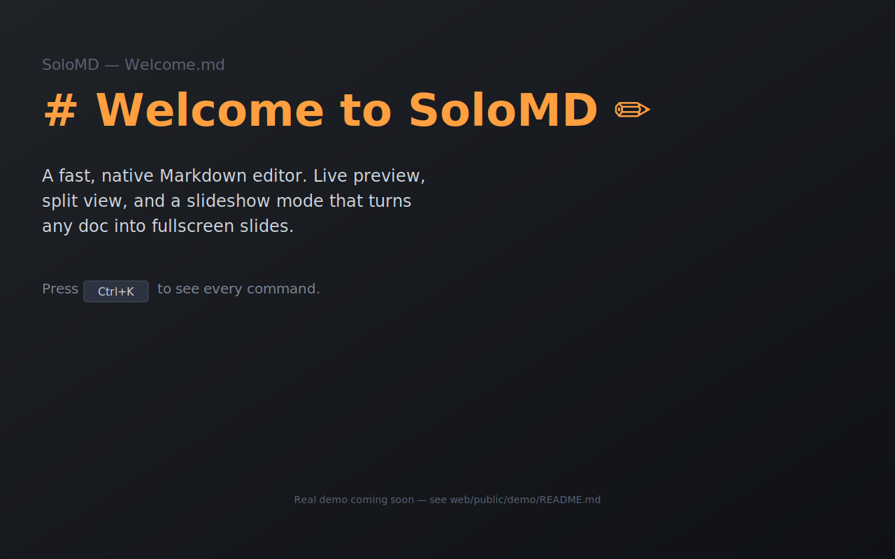
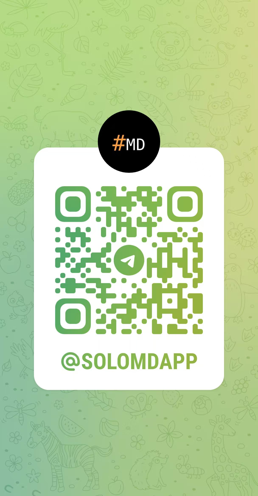

# SoloMD

> A markdown editor — and the bridge to your LLM.

[](https://github.com/zhitongblog/solomd/releases/latest)
[](LICENSE)
[](https://github.com/zhitongblog/solomd/releases)
[](https://solomd.app)

[**Download**](https://github.com/zhitongblog/solomd/releases/latest) · [**Website**](https://solomd.app) · [**Security**](https://solomd.app/security) · [**FAQ**](https://solomd.app/#faq) · [中文站点](https://solomd.app/zh)



Your notes live in a folder. **SoloMD is the editor on top — and the MCP endpoint Claude Code, Codex CLI, and Cursor can drive directly.** Same `.md` files, two ways in.

Built on Tauri 2 + Vue 3 + CodeMirror 6. Universal macOS dmg ~32 MB. Free, MIT, no subscription, no SoloMD-hosted servers. Your notes, AI keys, embeddings index, and git history all stay on your machine.

## Two halves of one product

**The editor.** WYSIWYG live edit (Typora-style), tabs + split panes, KaTeX + Mermaid, image paste to `_assets/`, slideshow mode (`⌘⌥P`), Vim mode, Hunspell + CJK proofread, semantic search (`⌘⇧F`), wikilinks + backlinks, Pandoc export. CJK encodings (GBK / Big5 / Shift-JIS) auto-detected.

**The endpoint.** A bundled `solomd-mcp` binary exposes the same vault to any MCP client — 13 tools out of the box, including 5 SoloMD-only ones (`autogit_log`, `autogit_diff`, `autogit_rollback`, `sync_status`, `share_url`) that no other markdown server has. Plus a `solomd agent <prompt>` CLI that hands off to Claude Code / Codex CLI with the MCP pre-wired.

| Feature | |
|---|---|
| **AI rewrite, BYOK** | 14 providers — OpenAI · Claude · Gemini · DeepSeek · Qwen · GLM · Kimi · Doubao · SiliconFlow · OpenRouter · Mistral · Groq · xAI · Ollama. Direct vendor calls. Keys in OS keychain. |
| **GitHub-backed sync** | Push your vault to a private GitHub repo on every save. Optional E2EE (Argon2id + XChaCha20-Poly1305). GitLab / Gitea / any HTTPS git URL works too. |
| **AutoGit per note** | Every `⌘S` is a commit in a local `.git` inside the workspace. libgit2 vendored, no system git needed. Never auto-pushed. |
| **MCP server bundled** | `solomd-mcp` ships in the install. 13 tools (8 generic + 5 SoloMD-only). stdio only, no network port. Read-only by default; `--allow-write` opt-in. |
| **Cloud-folder mode** | If your vault lives in `~/Library/Mobile Documents/...` or `~/Dropbox/...`, SoloMD detects it and adds cross-device session restore on top — the OS already does the file sync. |
| **Public read-only share** | Command palette → copy `solomd.app/share/?repo=...&path=...` link. Renders any file in your public GitHub repo, no SoloMD account needed to view. |

## Use it from your LLM

After installing SoloMD on macOS / Linux:

```bash
# One-shot: print the MCP config snippet for your AI client.
solomd mcp-config
```

```json
{
  "mcpServers": {
    "solomd": {
      "command": "/Applications/SoloMD.app/Contents/Resources/solomd-mcp",
      "args": ["--workspace", "/Users/me/Documents/SoloMD"]
    }
  }
}
```

Or just run an agent task end-to-end:

```bash
# Hands the prompt to claude / codex (whichever is on PATH) with
# solomd-mcp pre-wired, --allow-write enabled.
solomd agent "rewrite this week of dailies into a weekly review and commit it"
```

Path-traversal guarded; no network port; the LLM only sees what you point the workspace at.

## Install

Latest release: [v3.1.0](https://github.com/zhitongblog/solomd/releases/latest).

### macOS — universal dmg (Apple Silicon + Intel, notarized)

```
https://github.com/zhitongblog/solomd/releases/latest/download/SoloMD_3.1.0_universal.dmg
```

Or one-line install:

```bash
curl -fsSL https://solomd.app/install.sh | bash
```

### Windows — x64

- [`SoloMD_3.1.0_x64_en-US.msi`](https://github.com/zhitongblog/solomd/releases/latest/download/SoloMD_3.1.0_x64_en-US.msi)
- [`SoloMD_3.1.0_x64-setup.exe`](https://github.com/zhitongblog/solomd/releases/latest/download/SoloMD_3.1.0_x64-setup.exe) (NSIS)
- [`SoloMD_3.1.0_x64-portable.zip`](https://github.com/zhitongblog/solomd/releases/latest/download/SoloMD_3.1.0_x64-portable.zip) — no installer

```powershell
irm https://solomd.app/install.ps1 | iex
```

### Linux — x86_64 + aarch64

- `.AppImage` (universal), `.deb` (Debian/Ubuntu), `.rpm` (Fedora/RHEL) — both architectures from [the releases page](https://github.com/zhitongblog/solomd/releases/latest).

### iPad

[App Store](https://apps.apple.com/app/solomd/id6762498874) — same engine, native iPad UI.

## Compared

| | SoloMD | Obsidian | Typora | Tolaria |
|---|---|---|---|---|
| License | **MIT** | proprietary (free) | paid ($14.99) | AGPL |
| Stack | Tauri 2 (Rust + WebView) | Electron | Electron | Tauri 2 |
| Platforms | macOS · Win · Linux · iPad | macOS · Win · Linux · iOS · Android | macOS · Win · Linux | macOS · Linux |
| Installer | ~32 MB (mac) / ~10 MB (win) | ~120 MB | ~95 MB | ~25 MB |
| **MCP server** | **✅ bundled, 13 tools, 5 SoloMD-only** | ❌ (community plugins) | ❌ | ✅ generic |
| **Built-in AI rewrite** | **✅ 14 BYOK providers** | plugin only | ❌ | via external MCP |
| GitHub-backed sync | ✅ | ❌ (Obsidian Sync $96/yr) | ❌ | ❌ |
| End-to-end encryption | ✅ on your repo | ✅ on Obsidian's servers | ❌ | ❌ |
| Local RAG / semantic search | ✅ off by default | plugin only | ❌ | ❌ |
| Version history per note | ✅ AutoGit | plugin only | ❌ | ✅ |
| CJK encodings (GBK / Big5) | ✅ auto-detect | ❌ | ❌ | ❌ |

Detailed breakdowns: [vs Obsidian](https://solomd.app/compare/vs-obsidian) · [vs Typora](https://solomd.app/compare/vs-typora) · [vs Tolaria](https://solomd.app/compare/vs-tolaria) · [vs Marktext](https://solomd.app/compare/vs-marktext).

## Privacy & security

Pure client-side. Your `.md` files stay in the folder you chose. API keys live in the OS keychain (macOS Keychain / Windows Credential Manager / Linux libsecret), never in `localStorage` or any config file. AI requests go direct from your machine to the provider you picked — no SoloMD relay. RAG embeddings and the AutoGit repo are local-only. The MCP server speaks stdio, never opens a network port. The whole codebase is MIT and auditable.

E2EE sync uses Argon2id (RFC9106 default params) → XChaCha20-Poly1305 with deterministic nonces and path-as-AAD. Plaintext stays on your devices; the remote sees only ciphertext. Failed `sync.json` parsing is fail-closed — refuses to push rather than degrading to plaintext (a v3.0.x audit fix).

Full writeup: <https://solomd.app/security>.

## Build from source

Prereqs: Rust (stable), Node 18+, pnpm.

```bash
git clone https://github.com/zhitongblog/solomd.git
cd solomd/app
pnpm install
pnpm tauri dev      # dev with hot reload
pnpm tauri build    # release artifacts → src-tauri/target/release/bundle/
```

Linux additionally needs `libdbus-1-dev` for the keychain backend.

The MCP server is a separate crate at `mcp-server/`; the dev MCP harness used for end-to-end testing lives at `dev-mcp/`.

## Contributing

Issues and PRs welcome — [open one](https://github.com/zhitongblog/solomd/issues). For a sense of direction, see [`docs/roadmap.md`](docs/roadmap.md).

## Contact / 联系

One maintainer, two front doors. Async on [GitHub Discussions](https://github.com/zhitongblog/solomd/discussions). Real-time chat:

- **Telegram (international):** [@SOLOMDAPP](https://t.me/SOLOMDAPP) — release announcements + chat
- **WeChat (中文):** scan to add me — note "SoloMD" 注明 SoloMD 直接通过

<a href="https://solomd.app/#contact"></a>
&nbsp;&nbsp;
<a href="https://t.me/SOLOMDAPP"></a>

## License & credits

[MIT](LICENSE) © 2026 xiangdong li. SoloMD stands on Tauri 2, Vue 3, CodeMirror 6, markdown-it, KaTeX, Mermaid, libgit2, Pandoc, Hunspell, `keyring-rs`, and `rmcp`. Sponsor on [GitHub Sponsors](https://github.com/sponsors/zhitongblog) or via [solomd.app/#sponsor](https://solomd.app/#sponsor).
