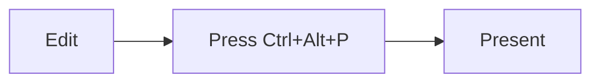

# Slideshow mode

SoloMD turns any Markdown document into a **fullscreen presentation** — no Keynote, no PowerPoint, no export step.

---

## How to start

Press **`Ctrl+Alt+P`** (or `Cmd+Alt+P` on Mac) — the active document opens in a new fullscreen window.

You can also run **"Present Slideshow"** from the command palette (`Ctrl+K`).

---

## How slides are split

Lines containing only `---` divide the document into slides:

```markdown
# Slide one

Hello.

---

# Slide two

Goodbye.
```

Front matter (`--- ... ---` at the very top) is ignored — it doesn't become a blank slide.

---

## Navigation

| Key | Action |
| --- | --- |
| → ↓ Space PageDown | Next slide |
| ← ↑ PageUp | Previous slide |
| Home / End | First / last slide |
| F | Toggle fullscreen |
| ? | Show shortcuts |
| Esc | Exit |
| Click | Next slide |

Vim users: `h j k l` works too.

---

## What renders

Everything the normal preview supports — code blocks with syntax highlighting, math, tables, footnotes, even Mermaid diagrams. Images load from disk relative to the source file.



---

## Tips

- **Title slide**: a single `# Heading` with one or two lines under it looks great.
- **Bullets**: keep to ~5 items per slide; the font size auto-scales to viewport.
- **Code**: fenced code blocks render with syntax highlighting. Big blocks may overflow — split them across slides.
- **Speaker mode** isn't built yet. Use a second monitor with the SoloMD edit window for now.

That's the whole feature. Try it on this document — press `Ctrl+Alt+P` right now.
