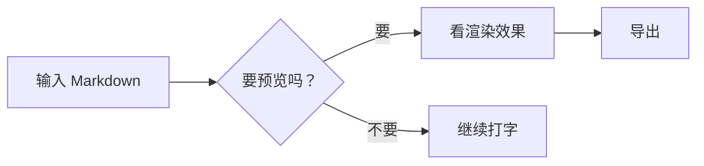

# Markdown 语法 — SoloMD 都支持哪些

这是一份能动手验证的速查表。切到 **预览** 模式（按 `Ctrl+Shift+P` 直到看到预览）就能看到每个块的渲染效果。

## 标题

```
# 一级   ## 二级   ### 三级   #### 四级
```

# 一级标题
## 二级标题
### 三级标题

## 行内

**粗体**、*斜体*、~~删除线~~、==高亮==、`行内代码`、[链接](https://solomd.app)、脚注[^1]。

[^1]: 脚注会自动编号。

## 列表

- 无序
  - 嵌套
- 还有

1. 有序
2. 列表
   1. 嵌套

- [ ] 任务列表
- [x] 已完成

## 引用块

> "Markdown 是带规则的纯文本。"
> —— 任何用过 CMS 的人

## 代码

```ts
function greet(name: string): string {
  return `你好，${name}！`;
}
```

## 表格

| 功能 | 编辑 | 预览 |
| --- | :--: | :--: |
| 自动换行 | ✓ | — |
| 大纲 | ✓ | ✓ |
| Mermaid | — | ✓ |

## 数学公式 (KaTeX)

行内：$E = mc^2$。

块级：

$$
\int_0^\infty e^{-x^2}\, dx = \frac{\sqrt{\pi}}{2}
$$

## 流程图 (Mermaid)



## Front matter

```yaml
---
title: 我的文档
imageRoot: ./images
---
```

`imageRoot` 是 SoloMD 的扩展 —— 粘贴/拖拽进来的图片会保存到这个目录（相对于文档所在位置）。

## 横线 = 演讲分页符

普通预览里 `---` 显示为横分隔线。**演讲模式**（`Ctrl+Alt+P`）里它是幻灯片之间的分页。
