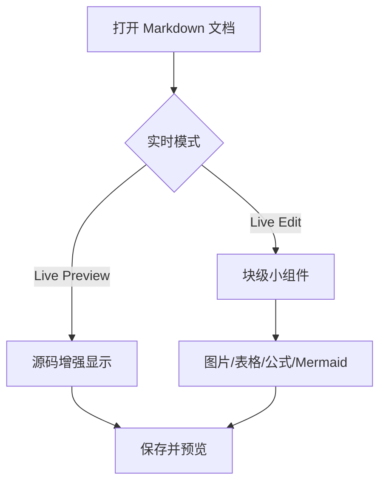
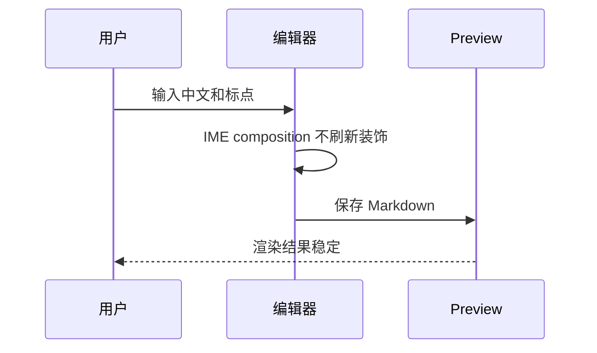

# SoloMD 实时模式 Markdown 支持测试文档

这份文档的重点是测试编辑器里的实时模式，不只是最终 Preview。测试时请同时观察三件事：

1. 输入是否可靠：中文输入法第一次按键、候选提交、标点符号和撤销重做都必须正常。
2. 实时渲染是否可靠：光标离开后应显示渲染态，光标进入后应恢复源码态或可编辑态。
3. 预览是否一致：右侧 Preview、导出 HTML/PDF 和实时模式的最终显示应尽量一致。

Windows 当前的 IME 安全版本优先保证中文输入稳定。如果 Windows 版本使用原生文本编辑区，CodeMirror 的 Live Edit 小组件不会在编辑区内出现；这时仍需要用 Split/Preview 验证渲染结果。macOS、Linux 或启用 CodeMirror 实时编辑的构建应完整执行本文的 Live Edit 项目。

## 0. 测试步骤

1. 在 SoloMD 中打开 `docs/markdown-support-test.md`。
2. 分别切换 Edit、Live Preview、Live Edit、Split、Preview。
3. 对每个测试块执行两次操作：先把光标点进源码，再把光标移到下一行或空白处。
4. 使用微软拼音和搜狗拼音分别在“IME 压力测试”区域输入中文。
5. 保存后重新打开本文档，确认图片、数学公式、Mermaid、表格和 tldraw 不随机丢失。

## 1. 实时模式验收矩阵

| 功能 | Live Preview 预期 | Live Edit 预期 | Preview/导出预期 |
| --- | --- | --- | --- |
| 中文输入 | 首次按键可进入组合态，提交后文本正确 | 首次按键可进入组合态，提交后文本正确 | 内容保持一致 |
| 中文标点 | `，。！？；：“”《》、（）` 不需要按两次 | `，。！？；：“”《》、（）` 不需要按两次 | 内容保持一致 |
| 标题 | 光标离开后弱化或隐藏 `#` | 光标离开后显示标题样式，光标进入后源码可见 | 渲染为标题 |
| 粗体/斜体/删除线 | 标记离开当前行后应弱化 | 光标离开后隐藏标记并显示样式 | 渲染为样式文本 |
| 链接 | 标签可读，源码可编辑 | 光标离开后显示标签，光标进入后显示完整 Markdown | 渲染为链接 |
| 独立图片行 | 可以正常编辑源码 | 光标离开后显示图片小组件 | 图片稳定显示 |
| 表格 | 源码可编辑 | 光标离开表格后显示表格小组件 | 渲染为表格 |
| 行内数学 | 源码可编辑 | 光标离开该行后显示行内公式 | 渲染为公式 |
| 块级数学 | 源码可编辑 | 光标离开公式块后显示数学小组件 | 渲染为公式 |
| Mermaid | 源码可编辑 | 光标离开代码块后显示图表 | 渲染为图表 |
| tldraw | 源码可编辑或显示画布 | 显示白板小组件 | 显示白板占位或画布 |
| Frontmatter | 源码区可编辑 | 不应破坏编辑体验 | 不显示为正文 |
| 脚注 | 源码区可编辑 | 不要求编辑区小组件 | Preview 中可跳转 |

## 2. IME 压力测试

请在下面每一行冒号后面输入中文。重点观察第一次按键、候选选择、回车提交、空格提交和标点。

微软拼音普通句子：

搜狗拼音普通句子：

微软拼音连续标点：

搜狗拼音连续标点：

中英文混输：SoloMD 实时模式 test 123 中文输入 Markdown

标点样本：，。！？；：“”‘’《》、（）【】——……

需要重复输入的句子：中文输入不应丢第一个字，标点不应按两次。

## 3. 光标显隐测试：标题和行内样式

# Live H1：光标离开后应显示一级标题样式

## Live H2：光标离开后应显示二级标题样式

### Live H3：光标离开后应显示三级标题样式

普通段落包含 **粗体文本**、*斜体文本*、***粗斜体文本***、~~删除线文本~~、`inline code`、==高亮文本==。

链接测试：[SoloMD GitHub](https://github.com/zhitongblog/solomd "SoloMD")。光标离开链接时应优先显示可读标签，光标进入时应能看到完整 Markdown 源码。

自动链接测试：https://example.com/path?a=1&b=中文

邮箱自动链接：test@example.com

HTML 实体测试：AT&amp;T、&lt;tag&gt;、&copy;

## 4. 列表、引用和任务项

- 无序列表第一项
- 无序列表第二项，包含 **粗体** 和 [链接](https://example.com)
  - 二级列表
  - 二级列表里的 `code`

1. 有序列表第一项
2. 有序列表第二项
3. 有序列表第三项

- [ ] 未完成任务
- [x] 已完成任务
- [ ] 任务项里输入中文：请测试搜狗和微软拼音

> 引用第一行：光标离开后引用符号应弱化或隐藏。
>
> 引用第二行，包含 **粗体**、`code` 和 [链接](https://example.com)。

## 5. 代码块测试

行内代码中的 Markdown 不应被渲染：`**not bold**`、`$not_math$`、`[not link](https://example.com)`。

```ts
type MarkdownCase = {
  name: string;
  realtime: boolean;
  expected: "source" | "rendered" | "preview-only";
};

const sample: MarkdownCase = {
  name: "中文输入和实时渲染",
  realtime: true,
  expected: "rendered",
};
```

```bash
pnpm install
pnpm build
pnpm test
```

## 6. Live Edit 块级小组件：独立图片行

下面两行必须保持为“单独一行的图片语法”，不要在同一行前后添加文字。Live Edit 中光标离开该行后应显示图片小组件，光标回到该行后应显示源码。


下面这一行是非独立图片，Live Edit 不应把整行折叠成图片小组件：

内联图片前后有文字  这一行仍应便于编辑。

图片稳定性回归点：

- 首次打开应显示图片。
- 切换文档后回来应显示图片。
- 保存后重新打开应显示图片。
- 文件名包含中文和空格时应显示图片。
- `imageRoot: ./assets` 下的相对路径应能解析。

## 7. Live Edit 块级小组件：表格

把光标放在表格内部时应能编辑源码；把光标移到表格外时应显示表格小组件。

| 类型 | Markdown 源码 | 实时模式预期 | Preview 预期 |
| --- | --- | --- | --- |
| 粗体 | `**bold**` | 显示粗体或保留可读源码 | 显示粗体 |
| 链接 | `[label](url)` | 可读标签，源码可恢复 | 可点击链接 |
| 中文 | `中文内容` | 不乱码 | 不乱码 |
| 对齐 | `:---:` | 不破坏列宽 | 按表格渲染 |

对齐表格：

| 左对齐 | 居中 | 右对齐 |
| :--- | :---: | ---: |
| alpha | beta | 100 |
| 中文 | 混排 mixed | 200 |

## 8. Live Edit 数学公式

行内公式：爱因斯坦公式 $E = mc^2$，勾股定理 $a^2 + b^2 = c^2$。

以下内容不应误判为行内公式：

- 价格 $5 不应该变成公式。
- 转义美元符号：\$x$ 不应该变成公式。
- 空公式 `$ $` 不应该变成公式。
- 代码里的 `$x + y$` 不应该变成公式。

块级公式，光标离开整个块后应显示数学小组件：

$$
\int_{-\infty}^{\infty} e^{-x^2} dx = \sqrt{\pi}
$$

单行块级公式：

$$a^2 + b^2 = c^2$$

## 9. Live Edit Mermaid

光标在代码块内部时应显示源码；光标移出代码块后应渲染 Mermaid 图。切换文档或滚动回来后不应随机空白。





## 10. Live Edit tldraw

tldraw 代码块在 Live Edit 中应显示白板小组件。预览或导出如果没有完整白板运行时，也至少不能破坏页面。

```tldraw
{
  "schema": "tldraw-test",
  "note": "This block is intentionally small for realtime widget testing."
}
```

## 11. Preview-only 语法

这些语法主要验证 Preview 和导出，不要求 Live Edit 一定生成编辑区小组件，但不能影响实时输入。

脚注引用：这里有一个脚注。[^note]

另一个脚注引用：实时模式不应因为脚注而卡顿。[^ime]

[^note]: 这是脚注正文，Preview 中应能正确编号和跳转。
[^ime]: 脚注中也可以包含中文输入、`code` 和 [链接](https://example.com)。

Wiki 链接：

- [[README]]
- [[README|自定义标题]]
- [[README#安装]]
- [[中文页面|中文别名]]

标签：#markdown #实时模式 #中文输入

Raw HTML：

<details>
<summary>展开 HTML details</summary>

这里是 HTML details 内部内容。Preview 中应可展开，编辑区中应保持可编辑。

</details>

<table>
  <thead>
    <tr><th>HTML 表格</th><th>预期</th></tr>
  </thead>
  <tbody>
    <tr><td>Preview</td><td>渲染为 HTML 表格</td></tr>
    <tr><td>Live Edit</td><td>不要求变成表格小组件</td></tr>
  </tbody>
</table>

## 12. 分隔线和边界输入

---

连续星号应作为分隔线：

***

包含反斜杠转义的内容：\*不是斜体\*，\[不是链接\]\(url\)，\# 不是标题。

包含尖括号的内容：<https://example.com> 和 <test@example.com>。

包含中文括号路径的链接：[中文路径](中文%20图片.svg)。

## 13. 幻灯片分隔符

下面的 `---` 可用于验证演示或分页导出。如果普通 Markdown 预览只显示分隔线，也可以接受。

---

# 第二页标题

这一页用于验证滚动、分页和实时模式切换后，光标位置不会错乱。

## 14. 回归检查清单

| 检查项 | 通过标准 | 结果 |
| --- | --- | --- |
| 微软拼音第一次输入 | 第一个字母进入组合态，不丢字 |  |
| 搜狗拼音第一次输入 | 第一个字母进入组合态，不丢字 |  |
| 中文标点 | 不需要按两次 |  |
| 光标进入标题 | 能看到并编辑 `#` |  |
| 光标离开标题 | 显示标题样式 |  |
| 光标进入链接 | 能看到完整 `[label](url)` |  |
| 光标离开链接 | 显示可读链接标签 |  |
| 独立图片 | 显示图片小组件或 Preview 图片 |  |
| 中文图片文件名 | 能稳定显示 |  |
| 表格 | 光标外显示表格，光标内可编辑源码 |  |
| 行内公式 | 光标外显示公式，不误判价格 |  |
| 块级公式 | 光标外显示公式块 |  |
| Mermaid | 光标外显示图表，滚动后不空白 |  |
| tldraw | 不破坏编辑和预览 |  |
| 保存重开 | 图片和图表不随机消失 |  |
| 导出 | HTML/PDF 内容和 Preview 一致 |  |

## 15. 手工记录区

测试环境：

- 操作系统：
- SoloMD 版本：
- 输入法：
- 是否启用 Live Edit：
- 是否启用 Split/Preview：

问题记录：

1. 
2. 
3. 
